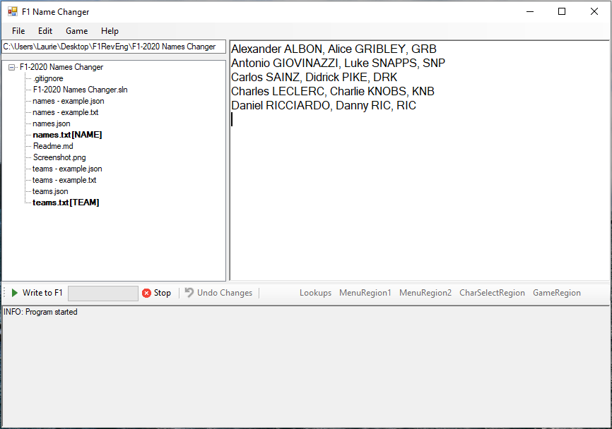

This is a memory editing tool to allow for the names in the F1 2020 game to be changed as the user wishes. The code is written in C# and is probably a little hacky in places, but should work for the most part - if it doesn't, please submit a bug report and I'll try to look at it.

I wrote this rather than using cheat engine, as I felt the scripting tools availble in cheat engine was rather limited.

Current stable version: https://github.com/Electronics/F1NameChanger/releases/tag/latest

# 1.18 Patch Woes

(copied from https://github.com/Electronics/F1NameChanger/pull/20)

Patch 1.18 of the F1 2020 game has proven rather problematic... The memory address space used has apparently increased by 256x meaning my magic fix of Find Offsets a bit more non-solutioney. To trawl through all memory space used would take hours with the way I search for the various bits and bobs.

The fixes (or work-arounds) I have made:

- The default Find Offsets now considers 2, larger, memory ranges. This now actually takes up to minutes to search through sadly.
- In some cases, this will still not find the correct starting addresses
- Added a new Find Offsets with Custom Start option in the Game menu. This allows for the search process to start at a specified address given in the popup in hexadecimal.

## tl;dr or how to make the F1NameChanger work now

If you want the quickest and most reliable method follow these steps:

1. Use [Cheat Engine](https://www.cheatengine.org/) to scan the F1 process for the Value Type: string of {o:mixed}Carlos{/o}.
2. There should only be one result, copy and paste the resulting address (Ctrl+C works) into popup searh offset of the new item Game -> Find Offsets with Custom Start
3. Should work as before!
4. This will likely need to be repeated every time the game starts :(

# Running

Simply download the executable from the releases section. Run the application and you should get the main GUI of the program.

The program is split into a tree file browser on the left hand side, an editor box on the right, and a status/log area at the bottom. The Lookup tables used for the name and team changes are given either as text files (basically a `csv`), or as a more complicated `json` format.
If a `names.json` or `names.txt` (and optional `teams.json` or `teams.txt`) file is in the same directory, these will be selected as the default lookup table (indicated with the files in the tree area appended with `[NAME]` and/or `[TEAM]`.
Double-click or File->Open files to open them in the editor on the right and save them afterwards with File->Save or Save As.

To provide a differently named file as a lookup table, simply right click the file you want to use, and select `Set as Names lookup` or `Set as Teams lookup`. Once the files are correctly setup, simply click the `Write to F1` button. This can be done before or after starting the F1 game.
Some example team and name lookup files can be found here as [names - example.txt](names%20-%20example.txt) and [teams - example.txt](teams%20-%20example.txt). [names.txt](names.txt) and [teams.txt](names.txt) contains all the original driver and team names so you don't need to lookup and type these in yourself.
Any issues or errors occured will show up in the log area at the bottom, accompanied with a red/green status of the section the error occurs in. Errors during regions writing to memory may cause subsequent runs of `Write to F1` to fail to identify memory regions. The game will need to be restarted in these cases.

There is an `Undo Changes` button, but this is no substitute for restarting the game and is still an untested feature! The changes are only made to the game in memory (RAM) and as soon as the game is closed, all changes are lost and reset to default.

Sometimes, espicially in different languages, the default memory offsets may not work, in this case restart the game and use "Game->Find Offsets". This should automatically find the offsets needed for your game, and will store them in an offsets.json file. This will then be used next time you run the tool.

See known issues below on problems with longer names in-game.

## Config

Due to how the ingame-names are stored, depending on the original length of the name (lastname usually as it shows up in the sidebar), the new name can be truncated by the game to the original name's length. This means your new name can be cut-off if it's too long! I'm sadly not aware of any fix for this, so you may need to shorten names with this issue, or use a different driver with a longer name for your new driver - if possible.

For team names, if you wish to have some lower-case sections of the name in the longer name, surround the particular bit with `{o:lower}` and `{/o}`. The short team names will be displayed as-is with the upper/lower case as typed. Team names are (for the most part) not limited in length.

##### `.txt`

The text files are the simplest way of configuring this tool as they are basically a csv file.

The text file can simply be opened as a csv or text file and consists of one driver per line (in no particular driver order): `old NAME, new NAME, newDriverTag`.
The teams file similarly, is one team per line: `old team name, new team name, shortened in-game name`. 
The `shortened in-game name` is the team name used in the leaderboards at the end of each session whereas the `new team name` is the name used in the main menus and character selection areas.
See the example files for a list of old driver/team names.

The names should always be formatted with the first name having the first letter capitalised and the rest lower case, and for the last name: always upper case. e.g. `Carlos SAINZ` would be correct, `carlos Sainz` would be wrong. This mostly only causes issues with the undo feature, so don't worry too much.

##### `.json`

The JSON file is a bit different as `"original NAME": {"name": "new NAME", "tag": "newDriverTag"},`.
For example `Carlos SAINZ, Example DRIVER, DRV` or `"Carlos SAINZ": {"name": "Example DRIVER", "tag": "DRV"},`.
All driver names should be in the format mixed-case first name ("Carlos"), upper-case last-name ("SAINZ") but the application *should* fix any issues with this.

# Memory Locations

- **Menu Region 1**: Where the names for leaderboards are kept, they are stored in their full name format i.e. `Carlos SAINZ`. Usually in memory in the format `{o:mixed}Carlos{/o} {o:upper}SAINZ{/o}` and limited to 39 bytes in total. The `{o:mixed}` bits can be ommitted without any penalty and I use this to account for longer names. The struct that the UTF-8 encoded strings sit in is in 64-byte chunks, but can have extra stuff in (I think relating to player models?)
- **Menu Region 2**: A continuation from Menu Region 1 but with a byte limit of 44 this time, for some reason the game segments these 2 and also intersperces some team name bits at the beginning and end causing some fragmentation
- **Character Selection Region**: Where the names are stored for the character selection screen on a new game. This region of memory is sadly not very continuous and contains some duplication for unknown reasons and fragmentation of other data again. Names usually aligned every 48 byte interval. For this region I search for names rather than checking on the byte alignment due to the duplications
- **In Game Region**: This region is a large regular table with a new line of data every 32 bytes, and is 7968 bytes long. The lines *usually* alternate between firstname, lastname, driver tag (3 letters); but sometimes if a driver name is too long is ommitted and skipped. All driver names and lines of text must be 9 bytes or less.
- **Team Names**: This is less of a region and just a jumble of strings used within the game, luckily, these offsets do not move around and are set statically. No length limitations exist other than running over into other bits of menu text.

# Observations / Known Issues

- Due to how the ingame-names are stored, depending on the original length of the name (lastname usually as it shows up in the sidebar), the new name can be truncated by the game to the original name's length. As far as I can tell, this can't be easily fixed in any way (see [Reverse Engineering](Reverse%20Engineering/Reverse%20Engineering.md)) for more details on this
- Lastnames of 3 characters might cause issues being incorrectly identified as driver tags, I don't think this is an issue unless this tool is run multiple times in sucession, or in future the game adds additional drivers with these properties
- Audio prompts from Jeff, subtitles, retirements and flags will still show the old driver names. I am working on the text bits, but the audio from Jeff will likely not be able to be changed.
- Lookups for 3 letter driver tags need to be completed for F2 and other drivers

For other issues, check the Issues tab here in github, and if you can't find anyone else with the same issue, post about it! The program automatically generates a log file that should be in the same directory. If you know C# and can figure out my spaghetti code you could even try to fix it yourself!
