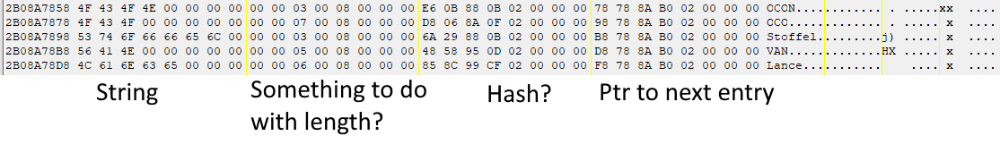
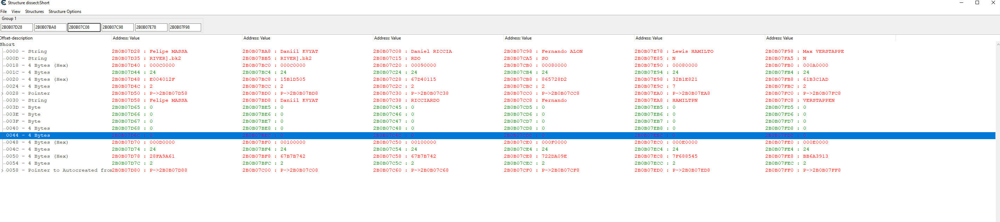

# Trying to fix the shortened names problem (I don't think it's possible)

Some last names that are too long (>9 characters) are stored in the "Character Selection" memory region rather than the "Game" region. In this case, we already can correctly set the names. However, if you are trying to change a character name that has a short last name, it will be truncated to the length of the original name as it doesn't fit in the "Game" region memory.

If you inspect the "Game" region memory, each entry is offset by 32 bytes, with the string, some numbers, a possible hash for a hashmap?, and a pointer to the next entry.

Names that are too long are skipped without any noticable indication, so this information must be held somewhere else.

^ First 2 columns are short names, the rest longer names.

If you look the in "Character Selection" where the longer names are stored, 2 patterns are used for the "longer" region (including this extra name that didn't fit in the game region) and the "short" region (just the full name).

Letting cheat engine auto-discover types in a struct set to 48 bytes long, the short regions all have pretty similar setups with the name terminated with a null byte, some padding string ("DRIVER].bk2") to make up the space to 0x18, an interesting number I'll come back to later, and then some miscallanous numbers, a possible hash for a hashmap and pointers to the next items.

Comparing these to the names that are longer than 9 characters and have an extra section at this point in memory, the number at offset 0x18 is always `0xc` for the shorter names, but is changed on the longer names. AND this new number happens to correspond to the length of the name in the extra bit.

i.e. for `Daniel RICCARDIO`, this number is `0x9` and his surname `RICCARDIO` which appears as the next section (used for the in game sidebar information) is 9 characters long. Similarly, `Lewis HAMILTON` has a length of `0x8`, `Max VERSTAPPEN` has a length of `0xA`.
`Fernando ALONSO` has a *first* name that is too long and likewise this number is `0x8` refering to the length of his firstname that comes in the next section.

So, to fix this issue with my current thinking, I would need to inject this extra section into the names that require a longer name, recreate all the pointer linking, recreate the game region to not include the name and possibly indicate this change somewhere else in memory.
Additionally, if these random numbers I previously mentioned might be a hash map, ARE a hashmap, I have no way of adding items to the hashmap, nevermind trying to fit this all in memory at this point as there is no free space around these items or arrays!
